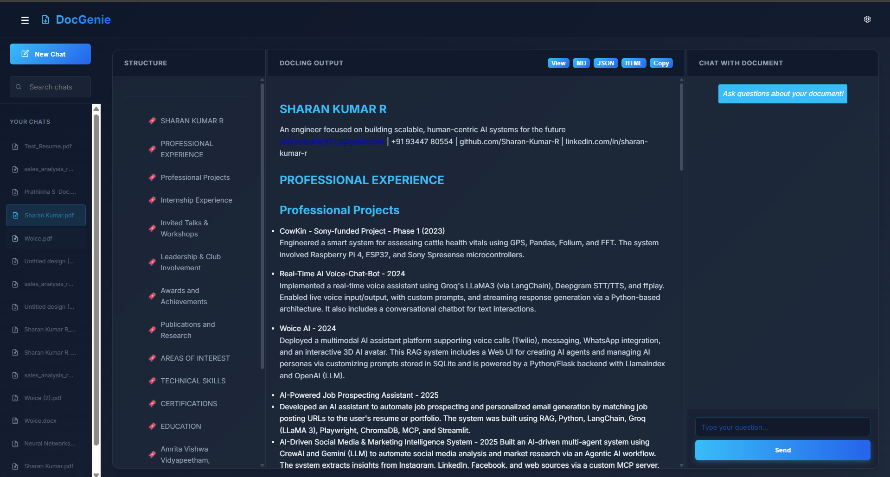

# DocGenie 🔍

A modern, AI-powered document analysis and chat application built with FastAPI and vanilla JavaScript. Upload documents (PDF, DOCX, PPTX, HTML, images) and interact with them using natural language queries powered by RAG (Retrieval-Augmented Generation).



## ✨ Features

### 📄 Document Processing
- **Multi-format Support**: PDF, DOCX, PPTX, HTML, PNG, JPG, JPEG
- **Smart Conversion**: Powered by Docling for accurate document parsing
- **OCR Support**: Optional OCR for scanned documents
- **Table Extraction**: Automatically extracts and preserves table structures
- **Markdown Output**: Clean markdown conversion with structure preservation

### 💬 AI-Powered Chat
- **RAG Integration**: Chat with your documents using AI
- **Context-Aware**: Intelligent responses based on document content
- **Chat History**: Persistent chat sessions with SQLite database
- **Multi-Session**: Manage multiple document conversations

### 🎨 Modern UI/UX
- **Toast Notifications**: Professional non-intrusive alerts (success, error, info, warning)
- **File Type Icons**: Visual indicators for different file formats in sidebar
- **Search with Highlighting**: Real-time search with matched text highlighting
- **Action Buttons**: Copy and text-to-speech for AI responses
- **Structure Navigation**: Click headings to jump to sections
- **Theme Toggle**: Switch between dark and light modes
- **Responsive Design**: Beautiful glassmorphism UI with smooth animations

### 🔧 Additional Features
- **Session Management**: Load previous conversations
- **Export Options**: Download as Markdown, JSON, or HTML
- **Smooth Animations**: Professional modal and transition effects
- **Sidebar Navigation**: Collapsible sidebar with file management

---

## 🚀 Getting Started

### Prerequisites
- Python 3.8+
- pip (Python package manager)
- Git

### Installation

1. **Clone the repository**
```bash
git clone https://github.com/Sharan-Kumar-R/Docling-Dev.git
cd Docling-Dev
```

2. **Install dependencies**
```bash
pip install -r requirements.txt
```

3. **Set up environment variables**

Create a `.env` file in the root directory:
```env
GOOGLE_API_KEY=your_google_api_key_here
```

> **Note**: Get your Google API key from [Google AI Studio](https://makersuite.google.com/app/apikey)

4. **Initialize the database**
The database will be automatically created on first run.

---

## 🎯 Running the Application

### Development Mode

```bash
uvicorn main:app --host 127.0.0.1 --port 8005 --reload
```

The application will be available at: **http://127.0.0.1:8005**

### Production Mode

```bash
uvicorn main:app --host 0.0.0.0 --port 8005
```

---

## 📁 Project Structure

```
Docling-Dev/
├── main.py                 # FastAPI application entry point
├── converter.py            # Document conversion logic
├── database.py             # SQLite database operations
├── rag.py                  # RAG engine for AI chat
├── requirements.txt        # Python dependencies
├── .env                    # Environment variables (API keys)
├── history.db             # SQLite database (auto-generated)
├── static/
│   ├── index.html         # Main HTML template
│   ├── style.css          # Application styles
│   ├── app.js             # Frontend JavaScript
│   └── uploads/           # Uploaded files directory
└── README.md              # This file
```

---

## 🛠️ Tech Stack

### Backend
- **FastAPI**: High-performance web framework
- **Uvicorn**: ASGI server
- **Docling**: Document parsing and conversion
- **Google Generative AI**: LLM for chat functionality
- **SQLite**: Lightweight database for chat history
- **Chonkie**: Text chunking for RAG

### Frontend
- **Vanilla JavaScript**: No framework dependencies
- **Marked.js**: Markdown rendering
- **Web Speech API**: Text-to-speech functionality
- **CSS3**: Modern animations and glassmorphism

---

## 📖 Usage

### 1. Upload a Document
- Click the upload area or drag & drop files
- Supported formats: PDF, DOCX, PPTX, HTML, PNG, JPG, JPEG
- Optional: Enable OCR for scanned documents

### 2. View Document
- **Docling Output**: Rendered markdown view
- **Structure**: Navigable document outline (click to jump to sections)
- **Export**: Download as MD, JSON, or HTML

### 3. Chat with Document
- Type questions in the chat input
- AI provides context-aware answers
- Copy responses or listen via text-to-speech
- Chat history is automatically saved

### 4. Manage Sessions
- View all previous sessions in the sidebar
- Search through your chat history
- Click any session to resume conversation
- Start new chat with "New Chat" button

### 5. Customize Settings
- Click ⚙️ icon (top-right) for theme settings
- Switch between Dark and Light modes
- Preferences saved automatically

---

## 🎨 UI Features

### Toast Notifications
Smart notifications for all actions (file uploads, errors, copy confirmations)

### Action Buttons
Hover over AI messages to reveal:
- **Copy**: Copy message to clipboard
- **Audio**: Hear message via text-to-speech

### Structure Navigation
Click headings in the Structure pane to smoothly scroll to that section

### Search & Highlighting
Type in the search bar to filter sessions and highlight matches

---

## 🔑 Environment Variables

| Variable | Description | Required |
|----------|-------------|----------|
| `GOOGLE_API_KEY` | Google Generative AI API key | Yes |

---

## 📦 Dependencies

```txt
fastapi
uvicorn
docling
google-generativeai
python-multipart
pydantic
chonkie
```

Install all with: `pip install -r requirements.txt`

---

## 🐛 Troubleshooting

### RAG Engine Initialization Warning
If you see "RAG Engine could not be initialized", check:
- Your `.env` file exists with valid `GOOGLE_API_KEY`
- Internet connection is active

### File Upload Errors
- Ensure `static/uploads/` directory exists (auto-created)
- Check file size limits
- Verify file format is supported

### Database Issues
- Delete `history.db` to reset (will lose chat history)
- Database recreates automatically on next run

---

## 🤝 Contributing

Contributions are welcome! Please feel free to submit a Pull Request.

---

## 📄 License

This project is open source and available under the [MIT License](LICENSE).

---

## 👨‍💻 Author

**Sharan Kumar R**

- GitHub: [@Sharan-Kumar-R](https://github.com/Sharan-Kumar-R)
- Repository: [Docling-Dev](https://github.com/Sharan-Kumar-R/Docling-Dev)

---

## 🙏 Acknowledgments

- [Docling](https://github.com/DS4SD/docling) for document processing
- [FastAPI](https://fastapi.tiangolo.com/) for the web framework
- [Google Generative AI](https://ai.google.dev/) for LLM capabilities

---

## 📸 Screenshots

### Dark Mode
Beautiful glassmorphism UI with smooth animations and professional design.

### Light Mode
Clean, accessible interface with optimized contrast.

### Features in Action
- Document upload and conversion
- AI-powered chat interface
- Structure navigation
- Search and filtering

---

**Made with ❤️ by Sharan Kumar R**


